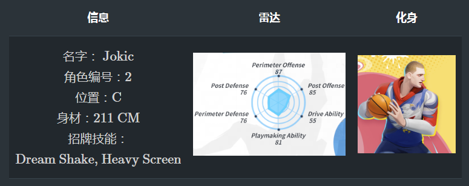
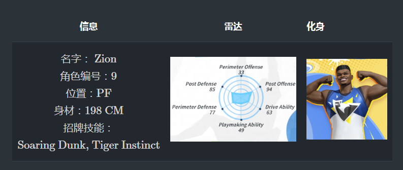
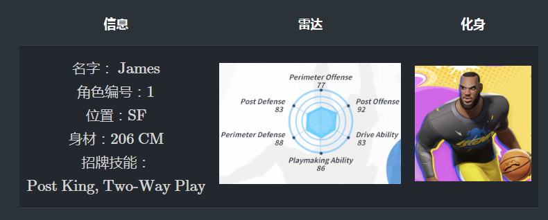
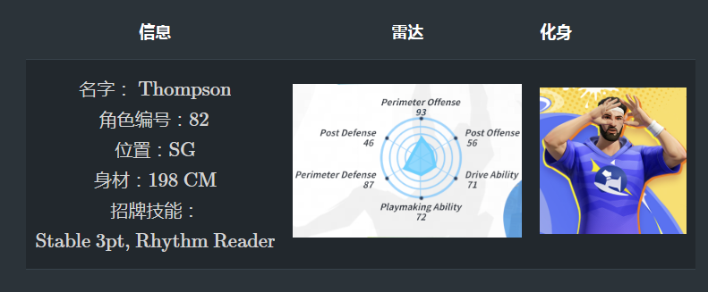
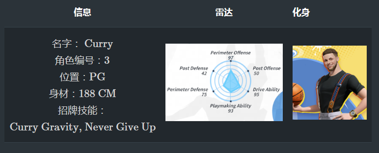

我们在游戏中接收的状态信息主要由以下三部分组成：

- 信息：**游戏的信息**，包括**奖励事件信息**和**结束值**。
- 原始状态 ：**环境的原始状态**，采用**字典**的形式。
- 标准行动：玩家对当前状态的标准行动。

//奖励事件是用来帮助用户构建环境奖励的事件，每一步都刷新。并且最终值在每轮结束时发送，并包含胜利或失败等信息，以帮助用户了解其他信息。

一个典型的状态可以表示为以下形式：

```json
// 仅用作示例，非真实值
{
    "[member_id]": [
        // infos信息
        {
            // 射击奖励事件信息
            "shoot":{
                "self_id": 1,
                "event_id": 1,
                "position": 2,
                "me": 1,
                "ally": 0,
                "enemy": 0,
                "opponent": 0,
                "open_shoot": 1,
                ... // 其他信息
            },
            // 状态事件信息
            "state_event":{
                "free_ball": 1,
            },
            // 结束值
            "end_values":{
                "id": 1,
                "win": 0,
                "delta": 0,
                "score": 0,
                "team_two_try": 1,
                ... // 其他信息
            }
        },
        // 原始状态
        {
            "global_states":{
                "attack_remain_time": 10.0,
                "match_remain_time": 150.0,
                "is_home_team": 1,
                ... // 其他信息
            },
            "self_state":{
                "character_id": 1,
                "position_type": 0,
                "buff_key": 0,
                "buff_value": 0,
                "stature": 200,
                ... // 其他信息
            },
            "ally_0_state":{
                "character_id": 2,
                "position_type": 1,
                "buff_key": 0,
                "buff_value": 0,
                "stature": 200,
                ... // 其他信息
            },
            "ally_1_state":{
                "character_id": 3,
                "position_type": 2,
                "buff_key": 0,
                "buff_value": 0,
                "stature": 200,
                ... // 其他信息
            },
            "enemy_0_state":{
                "character_id": 4,
                "position_type": 3,
                "buff_key": 0,
                "buff_value": 0,
                "stature": 200,
                ... // 其他信息
            },
            "enemy_1_state":{
                "character_id": 5,
                "position_type": 4,
                "buff_key": 0,
                "buff_value": 0,
                "stature": 200,
                ... // 其他信息
            },
            "enemy_2_state":{
                "character_id": 6,
                "position_type": 5,
                "buff_key": 0,
                "buff_value": 0,
                "stature": 200,
                ... // 其他信息
            }
        },
        // 合法动作
        [1,1,1,0,0,...,0]
    ]
}

```
---
奖励事件是一个用于帮助用户构建环境奖励的事件，每一步都会刷新。每轮结束时会发送结束值，并包含胜败等信息，以帮助用户了解额外的信息。它们将作为如下的独立部分介绍，如原始状态。

## 状态

环境的原始状态是一个包含以下键的字典：

* `global_state` : 游戏的全局状态，包括剩余攻击时间、玩家是主场还是客场等常见信息。
* `self_state`: 球员自身的状态，包括玩家的角色id、位置等。
* `ally_0_state`: 第一个友方玩家$0$的状态，与`self_state`类似。
* `ally_1_state`: 第二个友方玩家$1$的状态，与`self_state`类似。
* `enemy_0_state`: 第一个敌方玩家$0$的状态，与`self_state`类似。
* `enemy_1_state`: 第二个敌方玩家$1$的状态，与`self_state`类似。
* `enemy_2_state`: 第三个敌方玩家$2$的状态，与`self_state`类似。

`global_state`和代理状态（包括`self_state`和其他$5$名玩家）的更深入信息在下面的表格中显示。

### 全局状态  属于`global_state`

|变量名称|描述|范围|
|-|-|-|
|attack_remain_time|剩余攻击时间|[0,20.0)|
|match_remain_time|剩余比赛时间|[0,150)|
|is_home_team|球员是否是主队||
|home_score|主队得分（当前分数）|0,2,3|
|away_score|客队得分||
|ball_position_x（y，z）|球的三维笛卡尔坐标。(拾取球，亦或者是拦阻敌人？)||
|vec_ball_basket_x（y，z）|篮球架和球之间的笛卡尔距离（投篮时机预判？）||
|team_own_ball|我们的球队是否有控球权（进攻）|1：是的   0：不|
|enemy_team_own_ball|敌方球队是否有控球权（防守）|1：是的   0：不|
|ball_clear|球是否越过三分线（二分球/三分球策略）|1：是的   0：不|
|ball_status|球的状态|0：没有   1：手动：发生在跳球时  （一开始双方争抢球） 2:球处在空闲状态（在地上）   3：射出：在投射球的过程中 4：拥有：拥有 球  5:传球：在传球的过程中|
|can_rebound|球是否可以抢篮板|1：是的   0：不|
|dis_to_rebound_x（z，y）|球员和篮板之间的笛卡尔距离||
|can_block|球是否可以被封堵（盖了帽了）|1：是的   0：不|
|shoot_block_pos_x（z）|射出球的盖帽的位置||
|dis_to_block_pos_x（z，y）|无法盖帽的位置信息||
|block_diff_angle（r）|盖帽的所偏差的角度和距离||

### 球员状态
### 代理状态 `self_state`

|变量名称|描述|范围|
|-|-|-|
|character_id|玩家编号||
|position_type|球员的位置类型|0：C  （中锋，顾名思义乃是一个球队的中心人物，又叫5号位 ） 1:PF （大前锋，篮球比赛中的一个重要球员位置，又叫4号位） 2：SF（SF:小前锋，乃是球队中最重要的得分者，又叫3号位）   3：SG  （得分后卫，在篮球场上是以得分为主要任务的司职，又叫2号位） 4:PG（控球又称组织后卫，是篮球比赛阵容中的一个固定位置，又叫1号位）|
|buff_key|Buff的字典键|增益的名称|
|buff_value|增益的字典值|增益的具体数值|
|身材|球员身材（厘米）||
|rational_shoot_distance|球员合理射门距离||
|position_x（y，z）|玩家的笛卡尔坐标||
|v_delta_x|玩家在 x 轴上的速度||
|v_delta_z|玩家在 z 轴上的速度。**篮球场平面由x轴和z轴组成**||
|player_to_me_dis_x（z）|其他玩家？相对于玩家的距离||
|basket_to_me_dis_x（z）|篮筐相对于玩家的坐标||
|ball_to_me_dis_x（z）|球相对玩家的坐标||
|polar_to_me_angle（r）|在极坐标玩家的角度和距离？||
|polar_to_basket_angle（r）|极坐标玩家的角度和距离？||
|facing_x（y，z）|玩家的面向矢量||
|block_remain_best_time|盖帽的最佳时间||
|block_remain_time|盖帽的持续时间||
|is_out_three_line|是否在三分线外||
|is_ball_owner|是否是球的持有者||
|own_ball_duration|拥有球的持续时间||
|cast_duration|投射时间||
|power|投射的力度||
|is_cannot_dribble|是否不能够再运球||
|is_pass_receiver|是否传给接收者||
|is_marking_opponent|是否接到了对手的球||
|is_team_own_ball|队伍是否拥有球||
|inside_defence|内测防守（在对手的干扰框内？）||
|player_state|玩家状态|0-5|
|skill_state|玩家施放的当前动作类型|0-26|


`player_state`:（对以上变量的说明）

- `0`：没有
- `1`：默认、站立或无球移动
- `2`：握住，握住球
- `3`：运球，运球
- `4`：施法技能，施法技能
- `5`：中断、刚性或受控
`skill_state`:

| 索引 |     描述     | 索引 |       描述      | 索引 |          描述          |
| :--: | :----------: | :--: | :------------: | :--: | :-------------------: |
|  0   |     无动作      |  9   |     背筐（一种扣篮战术）      |  18  |        背筐过人        |
|  1   | 通用动作（平常没有操作时的状态）    |  10  |     篮板      |  19  |        碰撞停车        |
|  2   |     盖帽     |  11  |   接球       |  20  |      潜水接球        |
|  3   |    卡位     |  12  |      盯防      |  21  |         粗鲁封盖         |
|  4   | 叫球      |  13  |      投篮      |  22  |          凿出（待定）          |
|  5   |  过人    |  14  |      抢断      |  23  |          疾跑扣篮          |
|  6   |    防守      |  15  |  即时动作    |  24  |         跳跃盖帽         |
|  7   |     传球     |  16  | 前抢断冷却    |  25  |    被迫停止动作    |
|  8   |    捡球      |  17  |  快速防守    |  26  | 切换机制动作 |

## 奖励事件

奖励事件主要分为两部分。一是与 各种关键节点相关的事件 ，例如投篮和抢断，每个事件的关键名称将在下表中呈现。另一部分是 与连续状态相关的事件 ，例如三分球没有出界。

### 节点事件

每个节点事件都有一些共同的信息，如下表所示：

| 特征键 |                  描述                   |
| :----: | :-------------------------------------: |
| self_id |                 玩家ID                  |
| event_id |                事件玩家ID               |
| position |           事件玩家的位置类型           |
|   me    |          事件玩家是否是自己            |
|  ally   |         事件玩家是否是盟友             |
|  enemy  |          事件玩家是否是敌人           |
| opponent | 事件玩家是否是我的对手玩家 |

请注意，您需要区分事件玩家和玩家本身。事件玩家指的是事件的主体，例如投篮事件。但是，游戏仍会将此投篮事件信息发送给每个玩家，以便用户在进行多代理相关处理时共享信息。

奖励事件主要包括以下几点：

* `score`: 计分事件，玩家射击并成功得分。
* `shoot`: 投篮事件，玩家尝试投篮但不一定进球。
* `steal`: 抢断事件，玩家尝试抢断对方。
* `block`: 盖帽事件，玩家尝试盖帽对方。
* `pick up`: 捡球事件，玩家尝试捡起球。
* `rebound`: 篮板事件，玩家尝试篮板。
* `screen`: 盯防事件，玩家尝试盯防并黏住对手。

每个事件的唯一特征如下表所示。请注意，“筛选”没有其自己的独特特征。

对以上几个事件具体内容的扩展
|  事件键  |   特征键   |                         描述                          |
| :------: | :-------: | :---------------------------------------------------: |
| **score** |   score   |                         分数                         |
| **shoot** | open_shoot| 是否玩家处于开放位置或无干扰 |
|          |    two    |               是否是两分尝试                |
|          |   three   |               是否是三分尝试               |
|          |  goal_in  |                     是否进球                      |
|          | hit_percent |                        命中率（大概是游戏实时计算的命中率）                       |
|          |   assist  |             玩家是否参与助攻             |
|          | inference |             玩家是否参与推断（待定）             |
|          |inference_degree|                   推断程度 （待定）                   |
| **steal** |   target   |             玩家是否是抢断的目标             |
|          | hit_percent |                        命中率（大概是游戏实时计算的命中率）                       |
|          |  success  |                     是否成功                      |
| **block** |   target   |             玩家是否是盖帽的目标             |
|          |expected_score| 主要由是否是两分或三分尝试和防守干扰的程度决定的被盖帽玩家的预期得分 |
|          | hit_percent |                        命中率（大概是游戏实时计算的命中率）                       |
|          |  success  |                     是否成功                      |
| **pickup** |  success  |                     是否成功                      |
|**rebound** |  success  |                     是否成功                      |
|**screen**  |           |                      是否在盯防                            |

### 状态事件

状态事件如下表所示：

|     特征键     |                         描述                          |
| :------------: | :---------------------------------------------------: |
|**not_ball_clear**| 三分球没有出界，通常在转换拥有权时发生 |
|   **free_ball**   |               球不在任何玩家手中                |
|**attack_time_out**|                    进攻时间耗尽                    |
| **got_defended**  |                   玩家正在被防守                   |
| **out_of_defend** |                  玩家摆脱了防守                   |
|**no_defend_shoot**|              玩家在没有防守的情况下射击              |
|   **long_pass**   | 长传，这将导致玩家在游戏中变得僵硬 |
|   **pass_fail**   |                        传球失败                        |


## 结束值

在我们的环境中，游戏终止有两种形式：一种是当一方得分或进攻方时间用完，我们称之为**截断**；另一种是当一方赢得整场比赛，我们称之为**完成**。前者通常需要大约100步，而后者需要更长时间。因此，为了有效的训练，我们建议使用截断作为强化学习的信号，而不是完成。

此外，我们为每个**截断**提供一些结束值，以支持更多样的训练，如下表所示。

|    特征键     |                             描述                             |
| :----------: | :----------------------------------------------------------: |
|      id      |                        玩家的角色ID                        |
|     win     | 是否玩家队赢了。请注意，当进攻方时间用完时，两赢都可能得到“win=0” |
| team_score_panel  |                   队伍在计分面板上的得分                   |
| enemy_score_panel |                   敌队在计分面板上的得分                   |
|     win_panel     |     根据计分面板上的得分判断玩家队伍是否获胜     |
|   is_last_round   |                  是否为最后一轮                  |
|    delta    |                  得分差，可以是$0,\pm2,\pm3$                 |
|  delta_panel  |           根据计分面板上的得分计算的得分差           |
|   is_home   |                  玩家是否属于主场队                  |
| skill_type_cnt |                       使用的不同技能的数量                       |
|   skill_var   |            技能使用的次数的方差，可能是$NaN$            |
|  my_tot_try |                      玩家的总射击尝试                      |
| my_dazhao_cnt |                    施放终极技能的数量                   |
|  my_pass_cnt |                      玩家的总传球次数                      |
| my_rebound_cnt |                   玩家的总篮板次数                    |
| my_screen_cnt |                      玩家的总筛选次数                      |
| my_block_cnt |                     玩家的总盖帽次数                     |
| my_blocked_cnt |                 玩家被盖次数                  |
| my_steal_cnt |                     玩家的总抢断次数                     |
| my_stolen_cnt |                 玩家被抢次数                  |
| my_pickup_cnt |                     玩家的总捡球次数                     |
|   my_score  |                  玩家的得分，可能是$0,2,3$                  |
|  my_two_try |                  玩家的2分射击尝试                  |
| my_three_try |                  玩家的3分射击尝试                  |
|  team_score |                           队伍得分                           |
| team_tot_try |                     队伍的总射击尝试                     |
| team_two_try |                   队伍的2分射击尝试                    |
| team_three_try |                   队伍的3分射击尝试                    |
| team_block_cnt |                   队伍的总盖帽次数                    |
| team_rebound_cnt |                 队伍的总篮板次数                  |
| team_steal_cnt |                   队伍的总抢断次数                    |
| team_screen_cnt |                    队伍的总筛选次数                    |

## 动作

在我们的环境中，总共保留了52个动作，其中12个动作是所有玩家的公共动作，如下表所示。其余的是每个玩家的技能信息，这些技能的类型和数量各不相同，可以在`Players`部分的`Skill Info`中查阅。

这个表后跟的数字大概是移动的角度？
| 索引 |   描述   | 索引 |       描述       |
| :--: | :------: | :--: | :-------------: |
|  0   |  无操作  |  6   |     移动: 45     |
|  1   | 移动: 90 |  7   |     移动: 225    |
|  2   |移动: 270 |  8   |     移动: 315    |
|  3   |移动: 180 |  9   |   取消技能   |
|  4   |  移动: 0  |  10  | 向盟友1传球 |
|  5   |移动: 135 |  11  | 向盟友2传球 |

## 玩家

### 尼古拉·约基奇

#### 基础信息



#### 技能信息

| 索引 |         描述          | 索引 |         描述          | 索引 |         描述          |
| :--: | :-------------------: | :--: | :-------------------: | :--: | :-------------------: |
|  12  |         投篮          |  20  |        加速          |  28  |    稳定上篮    |
|  13  |   背筐，左轴旋转   |  21  |     跑动空中接球     |  29  |  约基奇的背筐动作  |
|  14  |   背筐，右轴旋转   |  22  |        跳球         |  30  |   重型封盖   |
|  15  |       呼唤球       |  23  |   第一次梦幻摇摆   |  31  |     精准传球     |
|  16  |        防守         |  24  |   第二次梦幻摇摆   |  32  |  钩射(左)  |
|  17  |        篮板         |  25  |     高视野传球     |  33  |  钩射(右)  |
|  18  |        盖帽         |  26  |       轻柔挑篮      |  34  |    快速投篮    |
|  19  |        抢断         |  27  |      重型盯防      |      |               |

### 蔡恩·威廉森

#### 基本信息



#### 技能信息

| 索引 |        描述         | 索引 |         描述          | 索引 |      描述      |
| :--: | :-----------------: | :--: | :-------------------: | :--: | :------------: |
|  12  |       向左突破       |  20  |     跑动空中接球     |  28  |    虎之本能    |
|  13  |       向右突破       |  21  |        跳球         |  29  | 双泵动作扣篮  |
|  14  |       呼唤球       |  22  |      飞跃扣篮      |  30  | 抓住&转身(左) |
|  15  |        掩护         |  23  |        凿出         |  31  | 抓住&转身(右) |
|  16  |        防守         |  24  |      凶猛抢断      |  32  |    空中接球    |
|  17  |        篮板         |  25  |       快速扣篮      |  33  |    边缘震动    |
|  18  |        盯防        |  26  |       跑上球       |      |               |
|  19  |        加速         |  27  |      跃步盖帽      |      |               |

### 詹姆斯 

#### 基本信息



#### 技能信息

| 索引 |       描述       | 索引 |        描述         | 索引 |           描述           |
| :--: | :--------------: | :--: | :-----------------: | :--: | :----------------------: |
|  12  |     向左突破     |  21  |   跑动空中接球1   |  30  |     低位之王(2分右侧)     |
|  13  |     向右突破     |  22  |     James的投篮     |  31  | 三分之王(三分左侧) |
|  14  |     呼唤球     |  23  | 坦克转身(左侧)  |  32  | 三分之王(三分右侧) |
|  15  |       掩护      |  24  | 坦克转身(右侧)  |  33  |    坦克扣篮(远距离)    |
|  16  |       防守       |  25  |     完全封盖     |  34  |   转身冲撞   |
|  17  |       篮板       |  26  |   集中三分球   |  35  |   单手扣篮   |
|  18  |       抢断       |  27  |     坦克冲撞     |  36  |   转身后仰投   |
|  19  |       盯防       |  28  |     突破跳投     |      |                         |
|  20  |      加速      |  29  |  低位之王(2分左侧)  |      |                         |

### 汤普森

#### 基本信息



#### 技能信息

| 索引 |      描述       | 索引 |         描述         | 索引 |        描述         |
| :--: | :-------------: | :--: | :------------------: | :--: | :-----------------: |
|  12  |       投篮       |  24  |         加速         |  36  |  过渡期拉起3(2)  |
|  13  |     向左突破     |  25  | 抓球&投篮(呼唤球)  |  37  |      传球&冲刺      |
|  14  |     向右突破     |  26  |       抓球&投篮       |  38  |  漂移传球(扣篮)  |
|  15  |     呼唤球     |  27  |        漂移射击        |  39  |  漂移传球(投篮)  |
|  16  |       掩护       |  28  |     滑动瓦解     |  40  |    冲刺&加速    |
|  17  |       防守       |  29  |      伪装射击传球      |  41  |     拉起漂移     |
|  18  |       篮板       |  30  |       节奏式冲刺       |  42  |    稳定3分(1)    |
|  19  |       盖帽      |  31  |        切入上篮        |  43  |    稳定3分(2)    |
|  20  |       盯防       |  32  |      节奏阅读者      |  44  |    稳定3分(3)    |
|  21  | 跑动空中接球1  |  33  | 节奏阅读者(扣篮) |  45  |   传球&冲刺(1)   |
|  22  |       跳球       |  34  |       稳定3分        |  46  |   传球&冲刺(2)   |
|  23  |   汤普森突破   |  35  |  过渡期拉起3(1)  |      |                     |

### 库里

#### 基本信息



#### 技能信息

| 索引 |    描述    | 索引 |         描述         | 索引 |         描述         |
| :--: | :--------: | :--: | :------------------: | :--: | :-----------------: |
|  12  |   向左突破   |  21  |   跑动空中接球1   |  30  |         冲刺         |
|  13  |   向右突破   |  22  |         加速         |  31  |       库有引力       |
|  14  |   呼唤球   |  23  |   跑动空中接球2   |  32  |         投篮         |
|  15  |     掩护     |  24  |         跳球         |  33  | 逆行运动(背后) |
|  16  |     防守     |  25  |      库里的投篮      |  34  | 逆行运动(左侧) |
|  17  |     篮板     |  26  |   坦克式转身(左)   |  35  | 逆行运动(右侧) |
|  18  |     抢断     |  27  |   坦克式转身(右)   |  36  |    转身&拉回    |
|  19  |     盖帽     |  28  |     突破后仰投     |  37  |      转身&投篮      |
|  20  |     盯防     |  29  | 低位之王(2分左侧) |  38  |   背后运球   |

## 内置规则

为了方便用户快速训练，我们在游戏中内置了两个规则：

* `Rule passing the ball beyond the three-point line`超过三分线传球规则：跨越三分线的行为主要在玩家过渡时发生，尽管可以学习这种行为模型，但它需要大量的时间并且不是游戏的主要焦点。
* `Rule passing when the ball is dead`当球死球时传球规则：与跨越三分线相似，也很难学习但不是AI训练的关键焦点。
